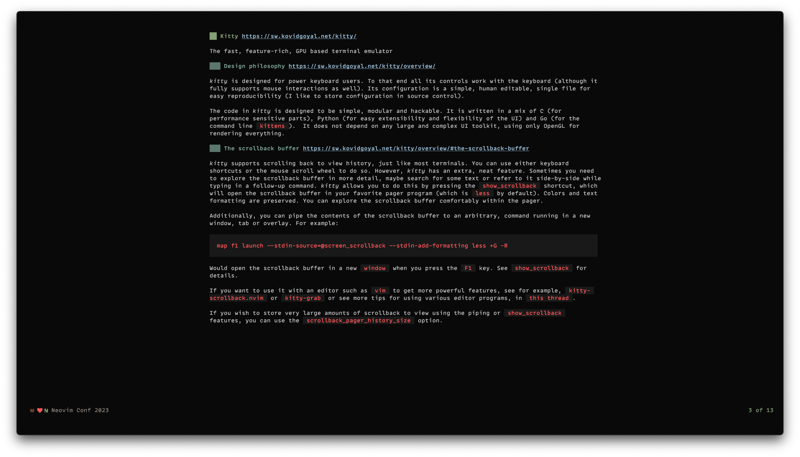

# ⚡️ Neovim Conf 2023: Developing [kitty-scrollback.nvim](https://github.com/mikesmithgh/kitty-scrollback.nvim)

[](https://www.youtube.com/watch?v=9TINe0J9rNg)

## Generate ASCII art
```sh
artem -c  --size=60 --centerX assets/neovimconf-logo.png --output assets/neovimconf-logo.ansi
```

## Run slideshow

> [!IMPORTANT]\
> This presentation is using the forked branch [neovimconf2023-kitty-scrollback-nvim](https://github.com/mikesmithgh/slides/tree/neovimconf2023-kitty-scrollback-nvim) of slides 
> which contains changes specific to this presentation.

```sh
slides slides.md
```

## Slides

---

---

---

---

---

---

---

---

---

---

---

---

